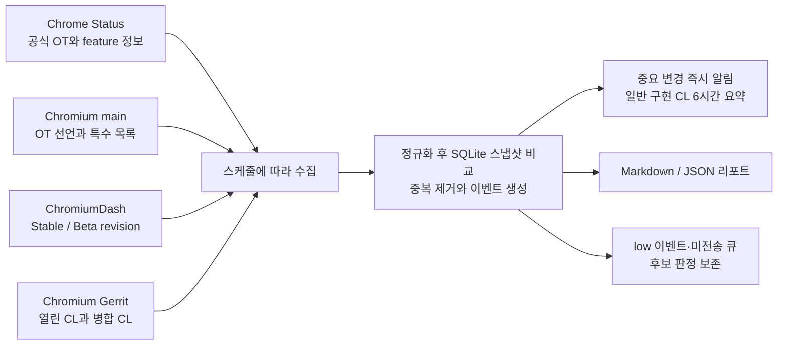

# Chrome Origin Trial Tracker

Chrome Status와 Chromium 소스를 GitHub Actions에서 30분 간격으로 확인해 Origin
Trial(OT) 변경을 Discord로 보내는 트래커다. 공식 OT의 등록·상태·마일스톤
변경부터 Chromium 구현 코드, Stable·Beta 반영 여부, 아직 Chrome Status에
등록되지 않은 후보까지 추적한다.

[설정 예시](config.example.toml) ·
[운영 워크플로](.github/workflows/track.yml) ·
[동작 방식](#동작-방식) ·
[Discord 알림 종류](#discord로-오는-알림) ·
[전체 이벤트 계약](#전체-이벤트-계약)

## 주요 기능

| 항목 | 내용 |
|---|---|
| 신규 OT | Chrome Status 전체 목록에서 새 trial ID를 자동으로 찾는다. 별도 목록을 관리하지 않는다. |
| OT 정보 | 상태, 시작·종료 milestone, 연장, 설명, 문서, third-party 허용 여부를 필드별로 비교한다. |
| Chromium 코드 | trial code와 RuntimeEnabledFeature 연결, 특수 OT 분류, 관련 구현 파일의 변경을 찾는다. |
| 등록 전 후보 | Chromium 선언과 Gerrit CL에서 OT 연동 흔적을 찾아 근거와 함께 저장한다. |
| Stable·Beta | ChromiumDash의 Linux Stable·Beta revision에서 OT 선언과 계약을 비교한다. |
| 운영 상태 | 수집원·GitHub Actions 장애를 알리고 24시간마다 heartbeat를 보낸다. Discord 전송 실패는 재시도 큐에 보관한다. |

변경이 없으면 변경 알림은 보내지 않는다. 단, 정상 동작 확인용 heartbeat는
24시간마다 보낸다. 기본 설정은 `medium` 이상만 전송하며, 첫 실행에서 저장한
baseline 자체는 변경 알림 대상에서 제외한다.

## Discord로 오는 알림

기본 설정인 `min_severity = "medium"`에서 아래 내용을 알린다.

| 구분 | 알림 내용 |
|---|---|
| 공식 OT | 신규 등록, 피드에서 제거·재등장, 상태, 시작·종료 milestone, 연장, trial code, 설명·문서·담당자 등 기본 정보 변경 |
| Chrome Status feature | 추적 시작·재개, 플랫폼별 OT stage milestone, Chromium trial code/ID, feature 정보 변경 |
| Chromium `main` | RuntimeEnabledFeature OT 선언의 추가·복원·제거, trial code 연결과 OT 계약 변경 |
| Stable·Beta | 최신 Linux 배포 revision에서 OT 선언이 추가·복원·제거되거나 계약이 바뀐 경우 |
| 병합된 Chromium 코드 | 활성 OT의 이름·runtime alias·구현 경로와 일치하는 Gerrit CL은 6시간 요약, 공통 OT framework 변경은 즉시 알림 |
| 공식 등록 전 후보 | Chromium `main` 또는 병합된 CL에서 찾은 미등록 OT 선언, 후보 근거 변경·복원·제거, 이후 공식 등록 여부 |
| 추적 공백 | 활성 OT의 Chromium 선언·구현 경로 누락, Chrome Status와 Chromium 사이의 OT 계약 불일치 및 복구 |
| 운영 상태 | 수집원 장애·복구, GitHub Actions 실패, 24시간 heartbeat |

일반 구현 변경은 KST 기준 `00–06`, `06–12`, `12–18`, `18–24` 구간으로 모은다.
구간이 끝난 뒤 첫 실행에서 병합 CL을 OT별로 묶어 한 번에 보낸다. 신규 OT,
마일스톤, OT 선언·계약, 공식 등록 전 후보, 수집 장애는 이 요약을 기다리지 않고
즉시 전송한다.

Stable·Beta 비교에서는 선언의 줄 번호와 원문 조각처럼 코드 위치만 달라진 값은
알림에서 제외한다. 같은 OT에 연결된 여러 RuntimeEnabledFeature의 계약이 똑같이
바뀌면 이벤트 이력은 각각 남기되 Discord에서는 한 항목으로 묶어 보여준다.

아직 병합되지 않은 Gerrit CL과 patchset 변경은 `low`로 내부 기록만 남긴다. 구현
후보를 일찍 살펴볼 수는 있지만, 승인되지 않은 변경으로 Discord 채널이 도배되는
것을 막기 위한 기준이다. `low`까지 받고 싶다면 `config.toml`의
`min_severity`를 `low`로 바꾸면 된다.

변경 알림에는 다음 정보가 들어간다.

- 이벤트 종류, 심각도, 수집원, 이벤트 번호
- 대상 OT 또는 Chrome Status feature 이름
- 바뀐 필드의 이전값과 새값 또는 코드 diff 요약
- 관련 milestone, 배포 채널, CL patchset, 변경 파일·함수 정보
- Chrome Status, Chromium 또는 Gerrit 원문 링크
- `YYYY-MM-DD HH:MM KST` 형식의 감지 시각

## 용어

| 용어 | 의미 |
|---|---|
| OT | Origin Trial. 웹 기능을 정식 출시하기 전에 실제 사이트에서 제한적으로 시험하는 제도 |
| Chromium Gerrit | Chromium 코드 변경을 제출하고 검토하는 시스템 |
| CL | Change List. GitHub Pull Request에 해당하는 코드 변경 제안 |
| Patchset | 같은 CL을 수정해 다시 올린 버전. 번호가 클수록 최신이다. |
| `NEW` / `OPEN` | 아직 병합되지 않은 CL. 검토나 승인 중일 수 있다. |
| `MERGED` | 검토를 마치고 Chromium 코드에 병합된 CL |
| `ABANDONED` | 병합하지 않고 닫은 CL |
| Runtime alias | OT trial code와 연결된 RuntimeEnabledFeature 이름 또는 검색 별칭 |
| Baseline | 첫 실행에서 저장하는 비교 기준. 기존 항목이 신규 변경으로 잡히는 것을 막는다. |

## 추적 범위

### 공식 OT

- 신규 trial ID 등록 및 사라졌던 ID의 재등장
- `ACTIVE`, `COMPLETE`, enabled/type 상태 변경
- 시작·종료·원래 종료 milestone과 연장 정보 변경
- 설명, 문서, feedback, owner, component, 표준화 신호 변경
- third-party origin 허용 여부 변경
- 공개 trial code와 Chrome Status OT stage 변경

Chrome Status의 `updated` 감사 시각처럼 기능 내용과 무관한 갱신값은 비교에서
제외한다.

### Chromium 코드

- `runtime_enabled_features.json5`의 OT 선언 추가·제거
- trial code ↔ RuntimeEnabledFeature 연결 및 OS·third-party·deprecation·base-feature 계약 변경
- navigation, persistent-to-next-response, expiry-grace-period 등 특수 OT 목록 변경
- 활성 OT 이름·runtime alias·지정된 구현 경로와 일치하는 병합 CL
- Stable·Beta 배포 revision의 OT 선언 및 계약 변경
- 활성 OT의 Chromium 선언 누락·복구

### 공식 등록 전 후보

- Chrome Status에는 없지만 Chromium `main`에는 있는 `origin_trial_feature_name`
- 미병합 Gerrit CL에 새로 추가된 OT 선언과 patchset 변경
- CL 제목이 아닌 실제 patch에서 확인한 `origin_trial_feature_name`과 runtime alias
- 후보가 이후 공식 OT로 등록되는 시점

#### Gerrit 기록·알림 기준

| CL 상태와 근거 | 내부 기록 | 기본 Discord 알림 |
|---|---|---|
| `NEW/OPEN` + OT 이름·runtime alias 직접 일치 | `low` | 전송하지 않음 |
| `NEW/OPEN` + 새 `origin_trial_feature_name` | `low` | 전송하지 않음 |
| `NEW/OPEN` + 구현 경로만 일치 | `low` | 전송하지 않음 |
| 직접 OT 신호가 유지된 patchset 변경 | `low` | 전송하지 않음 |
| 구현 경로만 일치한 patchset 변경 | `low` | 전송하지 않음 |
| `MERGED` + 활성 OT alias/path 일치 | `medium` | 6시간 단위로 OT별 요약 |
| `ABANDONED` | `low` | 전송하지 않음 |

미병합 CL은 근거 강도와 관계없이 `low`로 기록한다. DB와 리포트에는 남지만,
기본값인 `min_severity = "medium"`에서는 Discord로 보내지 않는다. CL이 병합된 뒤
활성 OT 구현과 연결되면 6시간 요약에 포함하고, 공식 등록 전 후보와 연결되면
`medium` 이상 이벤트로 즉시 알린다.

Gerrit 후보는 참고용이다. 출시 확정이나 보안 취약점을 뜻하지 않으며, 최종 판단
전에는 연결된 CL과 patch를 직접 확인해야 한다.

## 동작 방식



GitHub Actions에서 한 번 실행될 때 처리 순서는 다음과 같다.

1. `tracker-state` Release에서 암호화된 SQLite 상태를 복구하고 무결성을 검사한다.
2. Chrome Status, Chromium `main`, ChromiumDash Stable·Beta, Gerrit을 각각
   수집한다.
3. 출처마다 다른 응답을 비교 가능한 OT·feature·코드 선언 형태로 정규화한다.
4. 새 결과를 SQLite의 직전 스냅샷과 비교해 신규·변경·제거·복구 이벤트를 만든다.
5. 이벤트 키로 중복을 제거한다. `medium` 이상 중요 변경은 Discord 미전송 큐에서
   바로 보내고, 일반 구현 CL은 닫힌 6시간 구간을 OT별로 묶어 보낸다.
6. `reports/latest.md`와 `reports/latest.json`을 갱신하고, 24시간이 지났으면
   heartbeat를 보낸다.
7. 갱신된 SQLite를 암호화해 Release 자산과 최근 7일 일별 백업에 저장한다.

일부 수집원만 실패하면 그 출처의 마지막 정상 스냅샷을 유지한다. 나머지 출처는
계속 비교하고 실행 결과를 `partial`로 남기므로, 일시적인 API 장애가 OT 제거
알림으로 잘못 이어지지 않는다.

변경이 확인되면 이전값·새값, 변경 경로, 원문 링크를 이벤트에 기록한다. 같은
변경을 외부 cron과 GitHub 예비 스케줄이 연달아 확인해도 이벤트 키가 같으면 다시
저장하거나 전송하지 않는다.

새 OT는 두 경로로 잡힌다. Chrome Status 공개 목록에 trial ID가 생기면
`official_ot.registered`로 즉시 알리고, 그보다 먼저 Chromium 코드에서 OT 선언을
찾으면 `candidate.pre_registration_detected`로 기록한다. 미병합 CL에서만 보인
후보는 내부 기록으로 남고, `main` 반영이나 공식 등록처럼 근거가 확정되면 기본
Discord 알림 대상이 된다.

## 데이터 출처

| 출처 | 확인하는 내용 |
|---|---|
| [Chrome Status](https://chromestatus.com/) `/api/v0/origintrials` | 공식 OT 목록, 상태, milestone, trial code, 기본 정보 |
| Chrome Status `/api/v0/features/{id}` | 활성 OT의 owner, component, 문서, 표준화 신호, 플랫폼별 OT stage |
| [Chromium Gitiles](https://chromium.googlesource.com/chromium/src/) | `main`의 RuntimeEnabledFeature OT 선언과 특수 OT 소스 |
| ChromiumDash | Linux Stable·Beta 최신 release revision |
| [Chromium Gerrit](https://chromium-review.googlesource.com/) | 열린 CL, patchset, 병합·폐기 상태, 변경 파일, 실제 patch |

공식 OT 연동 방식은
[Chromium Origin Trials integration guide](https://chromium.googlesource.com/chromium/src/+/HEAD/docs/origin_trials_integration.md)를 따른다.

Gerrit 응답은 변경 파일 80개, 전체 patch 2MB를 넘으면 일부가 잘릴 수 있다. 이때는
`runtime_enabled_features.json5` diff를 별도로 요청해 OT 선언을 확인한다.

## 빠른 시작

Python 3.11 이상이 필요하다. 외부 Python 패키지는 사용하지 않는다.

```bash
git clone https://github.com/0xHunSec/ot-tracker.git
cd ot-tracker

PYTHONPATH=src python3 -m ot_tracker doctor
PYTHONPATH=src python3 -m ot_tracker sync
```

가상 환경에 개발 모드로 설치하면 `ot-tracker` 명령을 사용할 수 있다.

```bash
python3 -m venv .venv
.venv/bin/pip install -e .
.venv/bin/ot-tracker doctor
.venv/bin/ot-tracker sync
```

첫 `sync`에서는 비교 기준인 baseline만 저장한다. 기존 OT도 이벤트로 남겨야 할
때만 `sync --emit-baseline`을 사용한다.

### 생성되는 파일

| 경로 | 내용 |
|---|---|
| `var/ot-tracker.sqlite3` | 스냅샷, 변경 이벤트, 후보 판정, Discord 전송 이력, 미전송 큐 |
| `reports/latest.md` | 활성 OT 목록, 최근 변경, 추적 범위(coverage) 상태를 담은 Markdown 리포트 |
| `reports/latest.json` | 자동화용 JSON 리포트 |

## Discord 연결

### 필요한 봇 권한

Discord Developer Portal에서 앱과 봇을 만든 뒤 알림 채널에 아래 권한을 부여한다.

- 채널 보기
- 메시지 보내기
- 링크 임베드

관리자 권한과 Privileged Gateway Intent는 필요하지 않다.

### GitHub Actions 설정

워크플로가 참조하는 GitHub Environment 이름은 `DISCORD_BOT_TOKEN`이다. 해당
Environment의 Secret에 봇 토큰을 넣고, 채널 ID는 저장소의
**Settings → Secrets and variables → Actions → Variables**에 등록한다.

| 종류 | 이름 | 설명 |
|---|---|---|
| Environment Secret | `DISCORD_BOT_TOKEN` | Discord Developer Portal에서 발급한 봇 토큰 |
| Repository Secret | `STATE_ENCRYPTION_KEY` | 상태 DB 백업을 암호화하는 무작위 키. 별도 안전한 장소에도 보관 |
| Repository Variable | `DISCORD_CHANNEL_ID` | 알림을 보낼 채널 ID |
| Repository Variable | `TRACKER_ENABLED` | `true`로 설정해야 수집·알림 워크플로가 실행됨 |
| Secret(선택) | `HEALTHCHECKS_PING_URL` | Actions 시작·성공·실패를 보낼 Healthchecks.io Ping URL |

봇 토큰은 README, `config.toml`, 커밋, Actions 로그에 남기지 않는다. 설정 후
Actions에서 **Test Discord Connection** 워크플로를 실행해 연결을 확인한다.
Environment Secret을 `DISCORDBOT`이라는 이름으로 등록해도 사용할 수 있다.
두 이름이 모두 있으면 `DISCORD_BOT_TOKEN`을 우선 사용한다.

기본 상태에서는 **Tests**만 자동 실행된다. 봇 토큰, 채널 ID, 백업 암호화 키를
등록한 뒤 `TRACKER_ENABLED=true`로 설정하면 정기 수집과 Discord 알림을 시작한다.
기존 운영을 이전한다면 새 저장소의 실행을 확인한 후 이전 저장소의 스케줄과
외부 호출을 중지한다. 이전 저장소의 실행이 계속되면 그 계정의 사용량도 계속 쌓인다.

공개 저장소에서는 코드와 Actions 로그를 누구나 볼 수 있다. `config.toml`에는
실제 채널 ID를 넣지 않는다. 상태 DB에는 알림 이력과 수동 검토 메모가 포함되므로,
공개 Release에는 GnuPG AES-256으로 암호화한 파일만 업로드한다.
`STATE_ENCRYPTION_KEY`를 잃으면 기존 백업을 복구할 수 없다.

### 로컬 설정

로컬에서는 봇 토큰을 권한 `600`인 전용 파일에 저장한다.

```bash
install -d -m 700 ~/.config/ot-tracker
nano ~/.config/ot-tracker/discord-bot.env
chmod 600 ~/.config/ot-tracker/discord-bot.env
```

파일에는 토큰만 한 줄로 넣거나 `DISCORD_BOT_TOKEN=...` 형식으로 저장한다.
`config.toml`에는 채널 ID와 토큰 파일 경로만 둔다.

```toml
[discord]
enabled = true
transport = "bot"
bot_token_env = "DISCORD_BOT_TOKEN"
bot_token_file = "~/.config/ot-tracker/discord-bot.env"
channel_id_env = "DISCORD_CHANNEL_ID"
channel_id = "123456789012345678"
min_severity = "medium"
implementation_digest_hours = 6
```

```bash
PYTHONPATH=src python3 -m ot_tracker discord-test
PYTHONPATH=src python3 -m ot_tracker status
```

Incoming Webhook을 쓰려면 `transport = "webhook"`으로 바꾸고
`OT_TRACKER_DISCORD_WEBHOOK_URL` 환경변수를 설정한다.

### 알림 신뢰성

- 봇 토큰이 없거나 Discord 전송에 실패한 이벤트는 SQLite 큐에 남고 다음
  `sync`에서 재전송된다.
- 전송 보장은 at-least-once다. Discord 수신 직후 프로세스가 종료되면 같은 알림이
  한 번 더 전송될 수 있다.
- 일반 메시지는 이벤트를 최대 8개까지 묶는다. 구현 변경 요약은 메시지 하나에
  OT를 최대 6개까지 싣고, OT별 주요 CL 링크와 추가 건수를 표시한다.
- 구현 변경이 요약 시각을 기다리는 동안에는 `status`의 미전송 수에 포함될 수
  있다. 전송 실패가 아니라 의도된 대기 상태다.
- 알림 시각은 `YYYY-MM-DD HH:MM KST` 형식으로 표시한다. 내부 데이터는 UTC로
  저장한다.
- 수집원 장애·복구와 GitHub Actions 실패도 알림 대상이다.
- 변경이 없어도 24시간마다 heartbeat를 보내 정상 작동 여부를 알린다.

## 자동 실행 구성

`TRACKER_ENABLED=true`를 설정하면 GitHub schedule이 매시 `:17`과 `:47`에
수집을 시도한다. GitHub 스케줄은 지연되거나 일부 실행이 누락될 수 있으므로
정확한 시각의 실행을 보장하지 않는다. 외부 cron은 필수 구성 요소가 아니다.
공개 저장소에 60일 동안 활동이 없으면 정기 워크플로가 자동 비활성화될 수 있다.
이 경우 Actions 화면에서 다시 활성화한다.
[스케줄 동작과 제한](https://docs.github.com/en/actions/reference/workflows-and-actions/events-that-trigger-workflows#schedule)을 참고한다.

| 항목 | 현재 값 |
|---|---|
| 운영 저장소 | `0xHunSec/ot-tracker` |
| 실행 환경 | 공개 저장소의 표준 `ubuntu-latest` runner |
| 주 스케줄러 | GitHub Actions, 매시 `:17`·`:47` |
| 실행 경로 | `track.yml`의 `workflow_dispatch` |
| 중복 방지 | 공통 concurrency group과 SQLite 이벤트 키 |
| 구현 변경 요약 | KST 기준 6시간 단위, OT별 병합 CL 묶음 |
| 상태 백업 | `tracker-state` Release의 암호화된 자산과 최근 7일 일별 백업 |

공개 저장소의 표준 GitHub-hosted runner는 실행 시간 요금이 없다.
[GitHub Actions 과금 안내](https://docs.github.com/en/billing/concepts/product-billing/github-actions)를
참고한다. 대형 runner와 별도 저장 용량 과금은 다른 조건을 따른다.

상태를 복구할 때는 SHA-256, GnuPG 복호화, gzip, SQLite `quick_check` 검사를 거친다.
`tracker-state` Release의 최신 자산이 손상됐으면 최근 일별 백업부터 차례로
복구한다. GitHub Actions 실행은 concurrency group으로 직렬화하고, 로컬 실행은
SQLite 옆 lock 파일로 중복 실행을 막는다.

일부 수집원만 실패하면 기존 스냅샷을 유지하고 실행 상태를 `partial`로 기록한다.
`HEALTHCHECKS_PING_URL`을 설정하면 워크플로가 시작·성공·실패 ping을 보낸다.
실행 누락을 Discord로 받으려면 Healthchecks.io 프로젝트에도 Discord 연동을
별도로 설정해야 한다. Ping URL만 등록하면 누락 판정은 Healthchecks.io에 남지만
이 봇이 해당 알림을 대신 보내지는 않는다.

## 주요 명령

| 명령 | 용도 |
|---|---|
| `ot-tracker doctor` | Chrome Status, Chromium, Stable/Beta, SQLite, Discord 설정 점검 |
| `ot-tracker sync` | 수집, 변경 비교, 리포트 작성, Discord 전송을 한 번 실행 |
| `ot-tracker status` | 최근 실행, 추적 범위, 후보, 알림 큐 상태 확인 |
| `ot-tracker status --full` | 전체 상태와 진단 정보를 생략 없이 출력 |
| `ot-tracker events --since-hours 48` | 최근 48시간 이벤트 조회 |
| `ot-tracker candidates` | 공식 등록 전 후보 조회 |
| `ot-tracker triage <candidate-key> --disposition watching` | 후보의 수동 판정과 메모 저장 |
| `ot-tracker report` | 저장된 상태로 Markdown·JSON 리포트 재생성 |
| `ot-tracker discord-test` | Discord 채널 연결 테스트 |
| `ot-tracker discord-skip-pending --through-event <event-id>` | 과거 이벤트를 보존하되 지정 번호까지 Discord 전송 대상에서 제외 |
| `ot-tracker watch --interval-seconds 3600` | 로컬에서 한 시간 간격으로 반복 실행 |

소스에서 직접 실행할 때는 각 명령 앞에 `PYTHONPATH=src python3 -m ot_tracker`를
사용한다.

`sync --no-gerrit`은 Gerrit 수집을 건너뛰고, `sync --no-report`는 리포트 생성을
생략한다. 첫 baseline을 이벤트로 만들 때만 `sync --emit-baseline`을 사용한다.
이벤트는 `events --category <event-name>` 또는 `events --limit <count>`로 좁혀서
볼 수 있고, 제외한 후보까지 확인하려면 `candidates --include-rejected`를 사용한다.

### 후보 판정

후보 검토 결과는 `unknown`, `watching`, `rejected`, `promoted` 중 하나로 저장한다.
판정과 메모는 다음 `sync`에서도 유지된다.

```bash
PYTHONPATH=src python3 -m ot_tracker triage 'declaration:ExampleTrial' \
  --disposition watching \
  --note 'Blink CL과 Intent thread를 추가 확인'
```

`Frobulate*` 같은 테스트 scaffold도 삭제하지 않고 제외 근거와 함께 남긴다.
baseline 이전부터 있던 미등록 선언은 도입 시점을 확인할 수 없으므로 새 선언보다
낮은 신뢰도 점수를 부여한다.

## 코드 변경 탐지 범위

활성 OT의 trial code와 RuntimeEnabledFeature 이름은 자동 검색 별칭으로 사용한다.
이름이 나오지 않는 후속 CL까지 추적하려면 `config.toml`의
`[targets.<TrialCode>]`에 관련 symbol과 하위 시스템 경로를 등록한다.

새 OT가 공식 등록되면 바로 별칭 추적을 시작한다. 구현 경로가 없으면
`coverage.implementation_path_missing` 이벤트를 만들고 리포트에도 남긴다. 이후
Gerrit 변경에서 feature 전용 파일이나 디렉터리를 경로 후보로 수집한다. 미병합
CL에서 얻은 경로는 후보로만 보관하며, CL 병합 후 신뢰도 점수가 기본값 80 이상일
때만 추적 경로로 승격한다.

테스트·WPT·메타데이터 파일과 범위가 지나치게 넓은 공용 디렉터리는 자동 승격에서
제외한다. 추적 공백은 `reports/latest.md`의 `Coverage / unknowns`에서 확인한다.

## 전체 이벤트 계약

<details>
<summary>이벤트 이름과 의미 펼쳐보기</summary>

`기본 Discord`는 `min_severity = "medium"`일 때의 동작이다. 근거에 따라 등급이
달라지는 이벤트는 `조건부`로 표시했다.

### 공식 OT와 Chrome Status

| 이벤트 | 등급 | 기본 Discord | 의미 |
|---|---|---|---|
| `official_ot.registered` | high | 전송 | 공개 Origin Trials API에 신규 trial ID 등록 |
| `official_ot.reappeared_in_feed` | high | 전송 | 피드에서 사라졌던 trial ID 재등장 |
| `official_ot.removed_from_feed` | high | 전송 | 기존 trial ID가 공개 피드에서 사라짐 |
| `official_ot.status_changed` | high | 전송 | `ACTIVE`, `COMPLETE`, enabled/type 상태 변경 |
| `official_ot.milestone_changed` | high | 전송 | 시작·종료·원래 종료 milestone과 연장 변경 |
| `official_ot.metadata_changed` | medium | 전송 | 설명, 문서, feedback, owner, third-party 등 기본 정보 변경 |
| `official_ot.code_changed` | high | 전송 | 공개 trial code 변경 |
| `chromestatus.feature_tracking_started` | medium | 전송 | 공식 OT와 연결된 Chrome Status feature 추적 시작 |
| `chromestatus.feature_tracking_resumed` | medium | 전송 | 사라졌던 Chrome Status feature 추적 재개 |
| `chromestatus.ot_code_changed` | high | 전송 | feature OT stage의 Chromium trial code/ID 변경 |
| `chromestatus.ot_stage_milestone_changed` | high | 전송 | feature OT stage의 플랫폼별 milestone 변경 |
| `chromestatus.feature_metadata_changed` | medium | 전송 | owner, component, 문서, 표준화 신호 등 feature 정보 변경 |

### Chromium `main`과 배포 채널

| 이벤트 | 등급 | 기본 Discord | 의미 |
|---|---|---|---|
| `chromium.ot_source_file_changed` | low/high | 조건부 | RuntimeEnabledFeature 원본 변경은 low, 특수 OT 분류 소스 변경은 high |
| `chromium.ot_declaration_added` | medium/high | 전송 | RuntimeEnabledFeature에 OT 연결 추가 |
| `chromium.ot_declaration_restored` | high | 전송 | 제거됐던 OT 연결 복원 |
| `chromium.ot_declaration_removed` | high | 전송 | RuntimeEnabledFeature OT 연결 제거 |
| `chromium.ot_code_changed` | medium/high | 전송 | trial code 연결이나 OS·third-party 등 OT 계약 변경 |
| `chromium.release_ot_declaration_added` | medium/high | 전송 | Stable·Beta revision에 OT 연결 추가 |
| `chromium.release_ot_declaration_restored` | high | 전송 | Stable·Beta revision에서 OT 연결 복원 |
| `chromium.release_ot_declaration_removed` | high | 전송 | Stable·Beta revision에서 OT 연결 제거 |
| `chromium.release_ot_code_changed` | medium/high | 전송 | Stable·Beta revision의 OT 계약 변경 |

### Chromium Gerrit

| 이벤트 | 등급 | 기본 Discord | 의미 |
|---|---|---|---|
| `chromium.implementation_changed` | medium | 6시간 요약 | 활성 OT alias 또는 구현 경로와 일치하는 CL 병합 |
| `chromium.ot_framework_changed` | medium | 전송 | 공통 OT framework 파일을 바꾼 CL 병합 |
| `chromium.premerge_change_detected` | low | 미전송 | 활성 OT와 연결되는 미병합 CL 탐지 |
| `chromium.premerge_patchset_updated` | low | 미전송 | 추적 중인 미병합 OT CL의 patchset 변경 |
| `chromium.premerge_framework_change_detected` | low | 미전송 | 공통 OT framework를 수정하는 미병합 CL 탐지 |
| `chromium.premerge_change_merged` | low | 미전송 | 내부 추적하던 CL이 병합됨 |
| `chromium.premerge_change_abandoned` | low | 미전송 | 내부 추적하던 CL이 폐기됨 |

### 공식 등록 전 후보

| 이벤트 | 등급 | 기본 Discord | 의미 |
|---|---|---|---|
| `candidate.pre_registration_detected` | medium/high | 전송 | 공개 목록에 없는 Chromium `main` OT 선언 탐지 |
| `candidate.signal_restored` | medium/high | 전송 | 사라졌던 미등록 OT 후보 신호 복원 |
| `candidate.evidence_updated` | medium | 전송 | Chromium 선언 변화로 후보 근거 갱신 |
| `candidate.code_signal_detected` | medium/high | 전송 | 병합된 CL에서 공식 OT와 연결되지 않은 코드 신호 탐지 |
| `candidate.premerge_code_signal_detected` | low | 미전송 | 미병합 CL에서 신규 OT 연동 후보 탐지 |
| `candidate.premerge_patchset_updated` | low | 미전송 | 미병합 신규 OT 후보 CL의 patchset 변경 |
| `candidate.resolved_by_official_registration` | high | 전송 | 추적하던 후보 trial code가 공식 API에 등록됨 |
| `candidate.signal_removed` | medium | 전송 | 공식 등록 없이 후보 코드 신호가 사라짐 |
| `candidate.reclassified_as_noise` | low | 미전송 | 재검사 결과 후보를 테스트 코드 등 노이즈로 재분류 |

### 추적 범위와 수집 상태

| 이벤트 | 등급 | 기본 Discord | 의미 |
|---|---|---|---|
| `coverage.implementation_path_missing` | medium | 전송 | 활성 OT의 구현 경로 연결 정보 누락 |
| `coverage.implementation_path_added` | low | 미전송 | 구현 경로 연결 정보 복구 |
| `coverage.implementation_path_candidate_detected` | low/medium | 조건부 | Gerrit 구현 경로 후보가 승격 기준을 충족하면 medium |
| `coverage.runtime_declaration_missing` | high | 전송 | 활성 OT의 Chromium `main` 선언 누락 |
| `coverage.runtime_declaration_restored` | medium | 전송 | 누락됐던 Chromium `main` 선언 복원 |
| `coverage.cross_source_contract_mismatch_detected` | high | 전송 | Chrome Status와 Chromium의 OT 계약 불일치 |
| `coverage.cross_source_contract_mismatch_resolved` | medium | 전송 | 소스 간 OT 계약 불일치 해소 |
| `source.health_degraded` | high | 전송 | 수집원이 반복 실패하거나 데이터가 불완전한 상태 |
| `source.health_recovered` | medium | 전송 | 수집원이 다시 정상 상태로 복구됨 |

</details>

## 로컬 상시 실행

GitHub Actions 대신 로컬에서 계속 실행하려면 `deploy/systemd/`의 사용자 단위
서비스를 설치한다.

```bash
mkdir -p ~/.config/systemd/user
cp deploy/systemd/ot-tracker.service deploy/systemd/ot-tracker.timer \
  ~/.config/systemd/user/
systemctl --user daemon-reload
systemctl --user enable --now ot-tracker.timer
systemctl --user list-timers ot-tracker.timer
```

systemd 없이 터미널에서 반복 실행할 수도 있다.

```bash
PYTHONPATH=src python3 -m ot_tracker watch --interval-seconds 3600
```

## 저장소 구조

```text
src/ot_tracker/       수집, 변경 비교, 저장, 리포트, Discord 전송 코드
tests/                단위 테스트
.github/workflows/    주기 실행과 Discord 연결 테스트
scripts/              GitHub Release 상태 백업·복구
deploy/systemd/       로컬 상시 실행용 사용자 단위 서비스
reports/              최신 Markdown·JSON 리포트
var/                  로컬 SQLite 상태
```

## 테스트

```bash
PYTHONPATH=src python3 -m unittest discover -s tests -v
```
